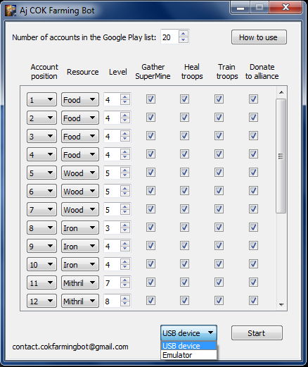
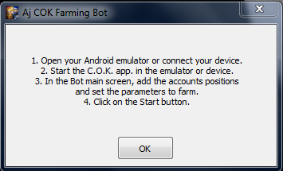
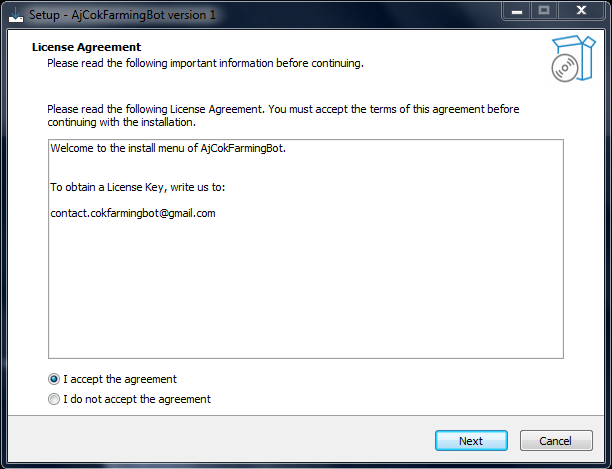
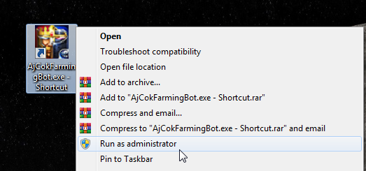
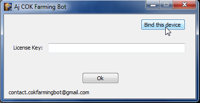
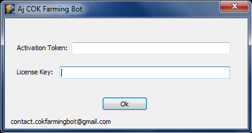

## Description
A farming bot for Clash Of Kings game, based on [OpenCV](https://opencv.org/) (computer vision), [PyTesseract](https://pypi.org/project/pytesseract/) and touches on screen through [pure-python-adb](https://pypi.org/project/pure-python-adb/).

## Author
**Abraham Hidalgo**
* [LinkedIn](https://www.linkedin.com/in/hidalgoabraham/)

## Screenshots

 
Main window: Configure the tasks that the bot will execute. You can add up to 999 farms.
 
 
 
 

 
How to use: To open de game, you can either connect your android device via USB or do it through an android emulator.
 
 
 
 

## How to use (for Windows OS):
Download the file [AjCokFarmingBot_Installer.exe](https://www.mediafire.com/file/5ubwfjo4rzrcawh/AjCokFarmingBot_Installer.exe/file) and execute it.

Follow the typical install menu:

 

 
 
 
 

Open the file AjCokFarmingBot.exe as administrator:

 

 
 
 
 

For the first time you will need to bind your device (your PC) by entering the Activation Token and the License Key. To buy a monthly subscription, write an email to contact.cokfarmingbot@gmail.com, ahidalgo3@uc.edu.ve or aj.hidalgo2310@gmail.com.

 

 
 
 
 

## Contact me
If you have any questions or want to hire me, please write an email to ahidalgo3@uc.edu.ve or aj.hidalgo2310@gmail.com.

## License

To obtain a License Key, write to contact.cokfarmingbot@gmail.com.

